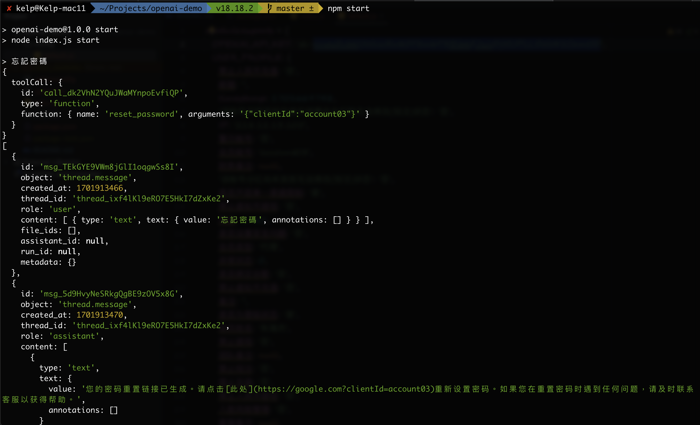

# openai-demo

## Set API Key
update config/default.js
```js
module.exports = {
	OPENAI_API_KEY: 'sk-your-api-key',
};
```


## Start CS
```bash
npm start
```



## Other commands
```bash
node .
```
```
Usage: openai-demo
	-------- Assistant -------------
	node . as ls
	node . as del <id>

	-------- Model -------------
	node . model ls

	-------- File -------------
	node . file ls
	node . file create <path>
	node . file del <id>

	-------- Run -----------
	node . start {gpt-4-1106-preview}
```
